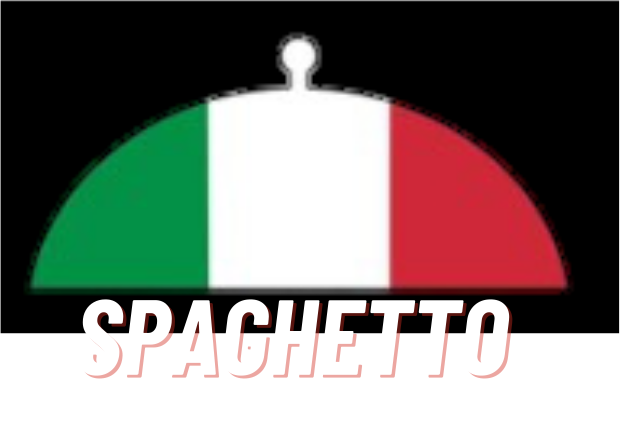
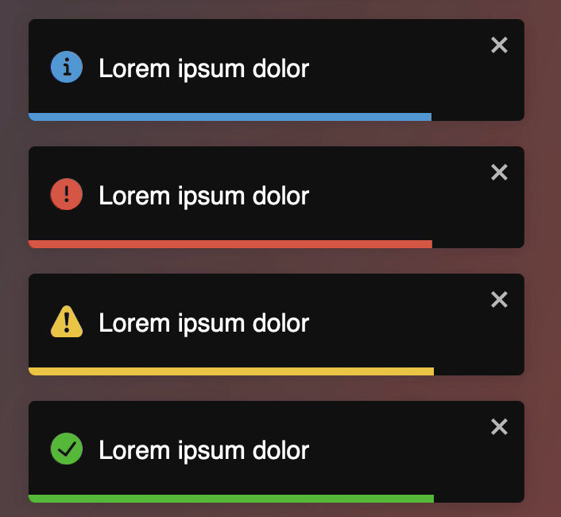
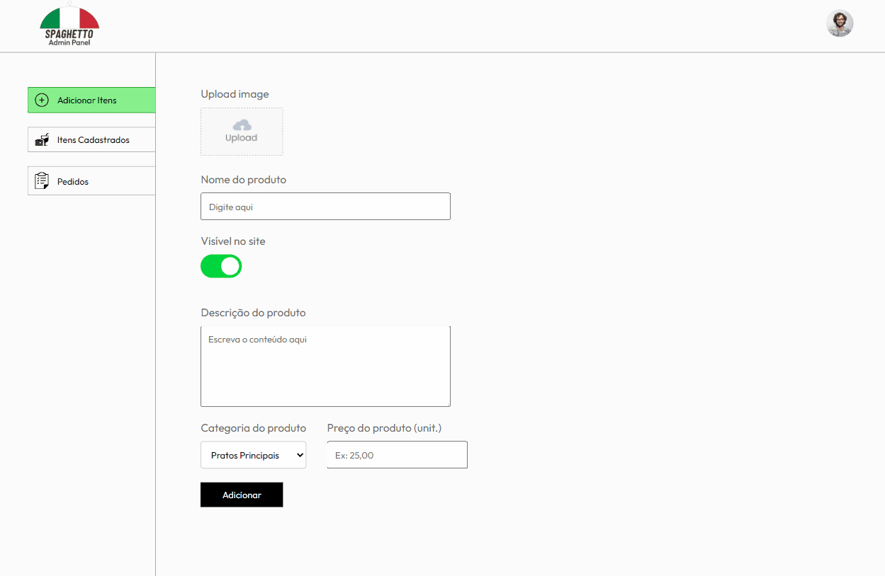

<h1 align="center">
    
</h1>

<p align="center">
    <a href="#sobre">Sobre</a>•
    <a href="#tecnologias">Tecnologias</a>•
    <a href="#pre-requisitos">Pré-requisitos</a>•
    <a href="#autores">Autores</a>
</p>


## Sobre
<p align="center">Spaghetto foi o nome escolhido pelos integrantes do grupo 4 para a empresa fictícia de delivery de pratos italianos, durante a realização de um projeto proposto no curso Rio Pomba Valley.<br>
A proposta do projeto foi desenvolver uma aplicação web para pedidos online em restaurantes, permitindo aos clientes escolher itens do menu, adicionar esses itens ao carrinho de compras e realizar o processamento de pagamento além de trazer funcionalidades de gerenciamento de pedidos e produtos.
</p>

## Tecnologias
<h3><li>Front-end 🎨</li></h3>

<p align="left">
  
  
  
  
  
</p>

<h3><li>Back-end 🎨</li></h3>
<p align="left">
  
  
  
  
</p>

## Pré-requisitos

✅ Antes de começar, você vai precisar ter instalado em sua máquina as seguintes ferramentas:
[Git](https://git-scm.com/), [Node.js](https://nodejs.org/pt).


````bash
# Clone este repositório
$ git clone <https://github.com/AplicacaoWeb-Restaurante/Spaghetto.git>

# Acesse a pasta admin do projeto no terminal/cmd
$ cd admin
# Instale as dependências
$ npm install
# Execute o painel do admin estando na pasta admin no terminal
$ npm run dev
# Acesse a página de admin do projeto pelo link que aparecer no terminal. Exemplo: 
 VITE v5.1.1  ready in 343 ms

  ➜  Local:   http://localhost:5174/
  ➜  Network: use --host to expose
  ➜  press h + enter to show help

# Acesse a pasta backend do projeto no terminal/cmd
$ cd backend
# Instale as dependências
$ npm install
# Execute o backend estando na pasta backend no terminal
$ npm run server

# Acesse a pasta frontend do projeto no terminal/cmd
$ cd frontend
# Instale as dependências
$ npm install
# Execute o frontend estando na pasta frontend no terminal
$ npm run dev
# Acesse a página de frontend do projeto pelo link que aparecer no terminal. Exemplo: 
 VITE v5.1.1  ready in 343 ms

  ➜  Local:   http://localhost:5173/
  ➜  Network: use --host to expose
  ➜  press h + enter to show help
````

## Preview
Uma breve apresentação da interface do site de pedidos:


Uma breve apresentação da interface do site para gerência:



## Autores
<li>Fernanda Coimbra</li>
<li>Heitor Riguete</li>
<li>Joyce Masalla</li>
<li>Luciano Filho</li>
<li>Paulo Bianque</li>
<li>Rayssa Alves</li>